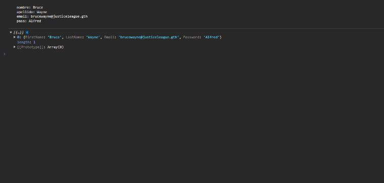

# Frontend Mentor - Intro component with sign up form

## Welcome! 👋

## Comentario en Español

  En este desafio he ido un poco mas allá de lo que se pedia para completarlo,  y he agregado validacion en cada uno de los campos. Ademas tambien se capturan los datos y se muestran por consola, en formato string, y en formato de objeto.
  
  En las capturas de pantalla se puede apreciar mejor.

## English comments
  In this challenge I have gone a little further than what was required to complete it, and I have added validation in each of the fields. In addition, data is also captured and displayed through the console, in string format, and in object format.
  
  You can see it better in the screenshots.

